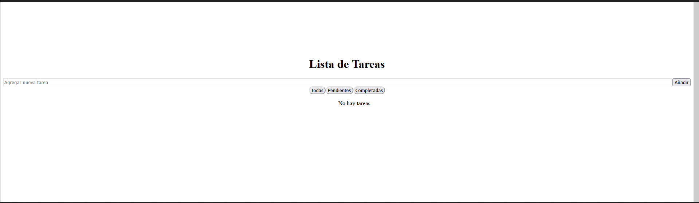
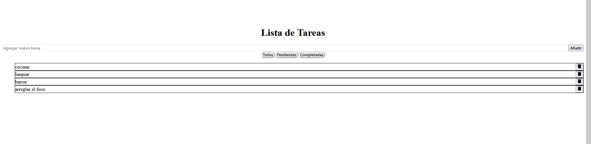
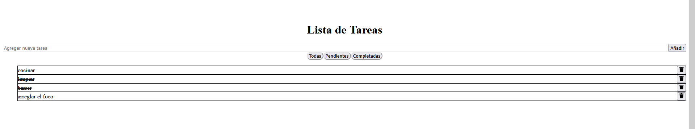
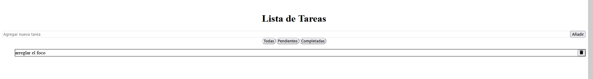
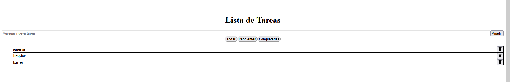
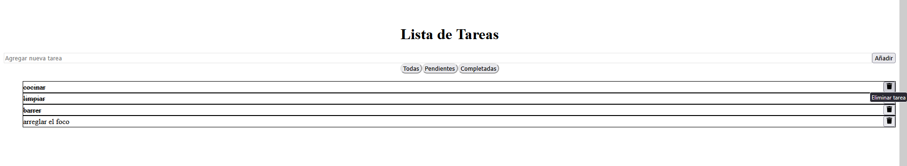
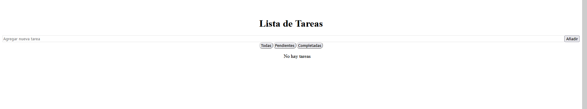

# 📝 React Todo App

Una aplicación simple de lista de tareas construida con **React**, **Tailwind CSS** y **Redux Toolkit**. Permite crear, visualizar, filtrar, actualizar y eliminar tareas de manera dinámica.



















()


## 🚀 Tecnologías utilizadas

- ⚛️ React 18+
- 🎨 Tailwind CSS
- 📦 Redux Toolkit
- 🧩 Vite (para desarrollo rápido)
- 🛠️ JavaScript (ES6+)

## 🎯 Funcionalidades

- Añadir tareas
- Marcar tareas como completadas o pendientes
- Eliminar tareas
- Filtrar por estado: Todas / Completadas / Pendientes
- Estilo moderno con Tailwind
- Gestión de estado global con Redux

## 📸 Capturas de pantalla

> Puedes agregar capturas aquí, por ejemplo:


## 🛠️ Instalación

Clona el repositorio y ejecuta los siguientes comandos:

```bash
# Clona el proyecto
git clone https://github.com/Eduardo1300/react-todo-app.git

# Entra a la carpeta del proyecto
cd react-todo-app

# Instala las dependencias
npm install

# Corre la aplicación
npm run dev
La aplicación estará disponible en: http://localhost:5173
```
📁 Estructura del proyecto
react-todo-app/
├── public/
├── src/
│   ├── components/
│   │   ├── TodoForm.jsx
│   │   ├── TodoItem.jsx
│   │   ├── TodoList.jsx
│   │   └── FilterBar.jsx
│   ├── redux/
│   │   ├── store.js
│   │   └── todoSlice.js
│   ├── App.jsx
│   ├── main.jsx
│   ├── App.css
│   └── index.css
├── tailwind.config.js
├── postcss.config.js
└── package.json

👨‍💻 Autor

    Eduardo Valdivia
    GitHub: @Eduardo1300
